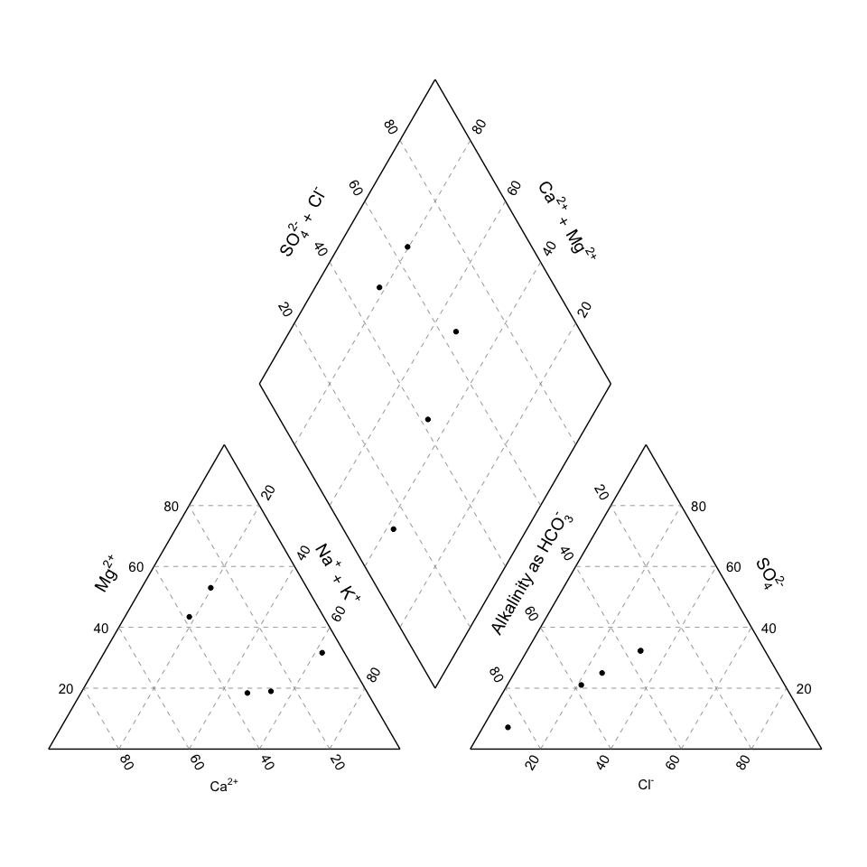
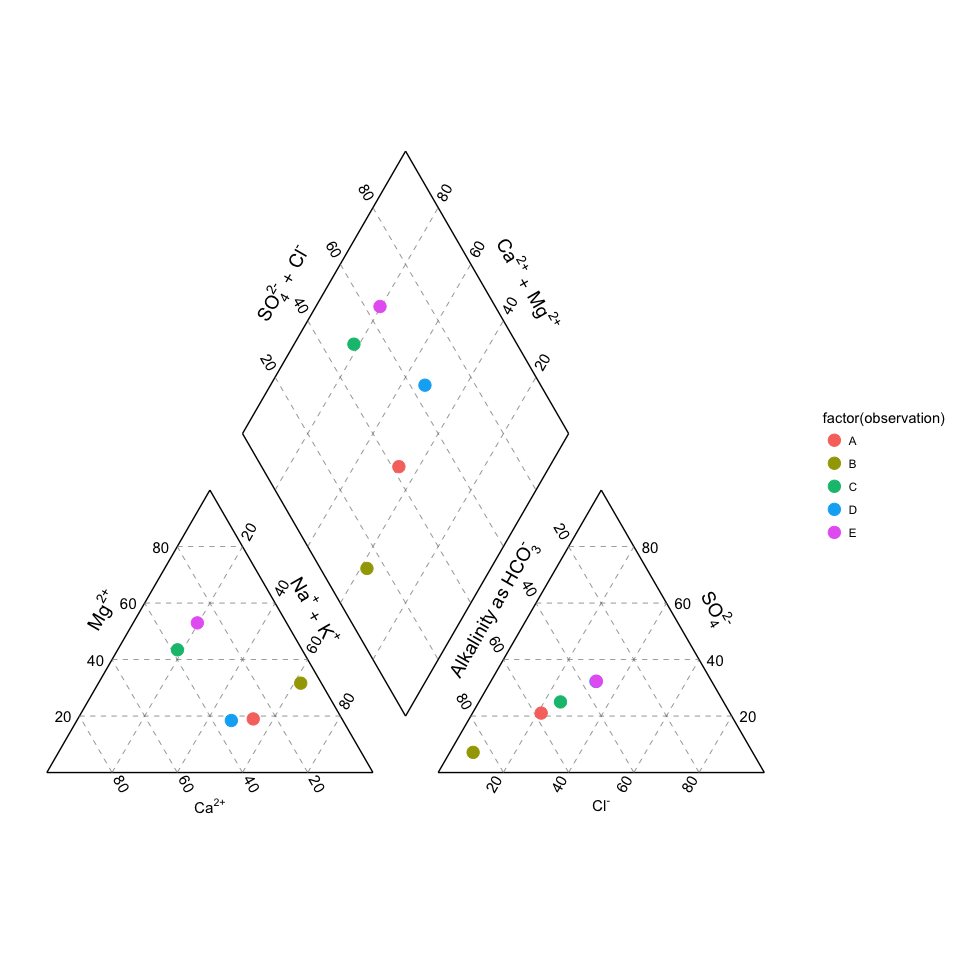
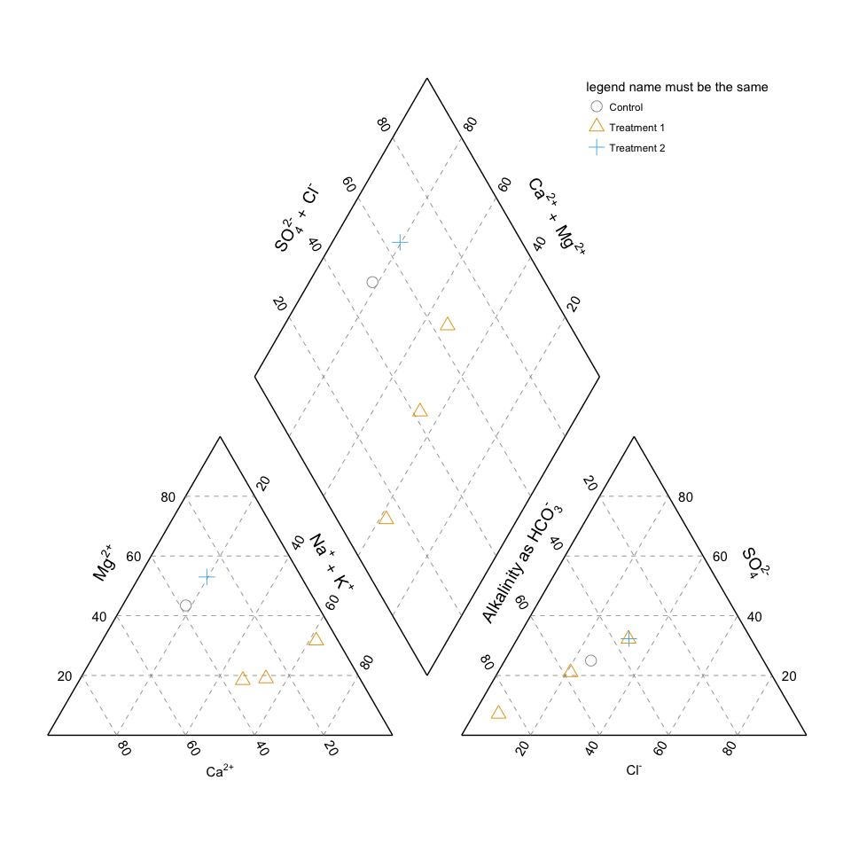

ggplot Piper Diagram
================
January 24, 2018

**This is a fork of the gist <https://gist.github.com/johnDorian/5561272> (by Jason Lessels, <jlessels@gmail.com>).** Forking a gist into a git-repository unfortunately does not preserve the relation to the forked project, sorry for that.

Jasons comments:

> A piper diagram based on the ternary plot example here: <http://srmulcahy.github.io/2012/12/04/ternary-plots-r.html>. *(this link is broken, Note from Marko, Jan 2018)*

> This was written quickly, and most likely contains bugs - I advise you to check it first. This now consists of two functions. *transform\_piper\_data()* transforms the data to match the coordinates of the piper diagram. *ggplot\_piper()* does all of the background.

``` r
source("ggplot_Piper.R")
library("hydrogeo")
```

Example
=======

Data input
----------

Input data need to be percent of meq/L !
*meq/L = mmol/L \* valence* ([Wikipedia: Equivalent (chemistry)](https://en.wikipedia.org/wiki/Equivalent_(chemistry))) with

| element | valence |
|---------|---------|
| Ca      | 2       |
| Mg      | 2       |
| Na      | 1       |
| K       | 1       |
| Cl      | 1       |
| SO4     | 2       |
| CO3     | 2       |
| HCO3    | 1       |

### Example data

``` r
milliequivalents <- list(Ca   = c(43, 10, 73, 26, 32),
                         Mg   = c(30, 50, 83, 14, 62),
                         Na   = c(54, 76, 3, 14, 12),
                         K    = c(31, 22, 32, 22, 11),
                         Cl   = c(24, 10, 12, 30, 43),
                         SO4  = c(24, 10, 12, 30, 43),
                         CO3  = c(24, 10, 12, 30, 43),
                         HCO3 = c(42, 110, 12, 3, 4),
                         "WaterType" = c(2, 2, 1, 2, 3),
                         "SecondFactor" = c("low", "low", "high", "high", "high"),
                         IDs = c("A","B","C","D","E") )
percents <- toPercent(milliequivalents)

data <- as.data.frame(percents)

data
```

    ##          Ca       Mg        Na         K        Cl       SO4       CO3
    ## 1 27.215190 18.98734 34.177215 19.620253 21.052632 21.052632 21.052632
    ## 2  6.329114 31.64557 48.101266 13.924051  7.142857  7.142857  7.142857
    ## 3 38.219895 43.45550  1.570681 16.753927 25.000000 25.000000 25.000000
    ## 4 34.210526 18.42105 18.421053 28.947368 32.258065 32.258065 32.258065
    ## 5 27.350427 52.99145 10.256410  9.401709 32.330827 32.330827 32.330827
    ##        HCO3 WaterType SecondFactor IDs
    ## 1 36.842105         2          low   A
    ## 2 78.571429         2          low   B
    ## 3 25.000000         1         high   C
    ## 4  3.225806         2         high   D
    ## 5  3.007519         3         high   E

### Check...

... should add up to 100%

``` r
cation.sums <- apply(data[, c("Ca", "Mg", "Na", "K")], 1, FUN = sum)
anion.sums  <- apply(data[, c("Cl", "SO4", "CO3", "HCO3")], 1, FUN = sum)

cation.sums
```

    ## [1] 100 100 100 100 100

``` r
anion.sums
```

    ## [1] 100 100 100 100 100

Transformation
--------------

``` r
piper_data <- transform_piper_data(Ca   = data$Ca,
                                   Mg   = data$Mg,
                                   Cl   = data$Cl,
                                   SO4  = data$SO4,
                                   name = data$IDs)
 piper_data <- merge(piper_data,
                     data[, c("WaterType", "SecondFactor", "IDs")],
                     by.y = "IDs",
                     by.x = "observation")

piper_data
```

    ##    observation         x          y WaterType SecondFactor
    ## 1            A  63.29114  16.443608         2          low
    ## 2            A 151.57895  18.232211         2          low
    ## 3            A 107.95137  93.797800         2          low
    ## 4            B  98.15552  62.579672         2          low
    ## 5            B  77.84810  27.406013         2          low
    ## 6            B 130.71429   6.185929         2          low
    ## 7            C  94.16230 131.355440         1         high
    ## 8            C 157.50000  21.650750         1         high
    ## 9            C  40.05236  37.633764         1         high
    ## 10           D 168.38710  27.936452         2         high
    ## 11           D 115.94228 118.774030         2         high
    ## 12           D  56.57895  15.953184         2         high
    ## 13           E  46.15385  45.892188         3         high
    ## 14           E 168.49624  27.999466         3         high
    ## 15           E 102.15989 142.898011         3         high

Plot
----

The piper function now just plots the background

``` r
ggplot_piper()
```


Now points can be added like...

``` r
ggplot_piper() + geom_point(aes(x,y), data=piper_data)
```



... colouring the points can be done using the observation value

``` r
ggplot_piper() + geom_point(aes(x,y, colour=factor(observation)), data=piper_data)
```


The size can be changed like..

``` r
ggplot_piper() + geom_point(aes(x,y, colour=factor(observation)), size=4, data=piper_data)
```



Grouping by multiple factors:

``` r
ggplot_piper() + geom_point(aes(x,y,
                                color = factor(WaterType),
                                shape = SecondFactor),
                            size = 4, stroke = 2, data = piper_data) +
  scale_shape_manual(values = c(21:26)) +
  theme(legend.position = "top", legend.text = element_text(color = "red", size = 20))
```


Advanced example:

``` r
ggplot_piper() + 
  geom_point(aes(x, y,
                 colour = factor(WaterType),
                 shape  = factor(WaterType)), 
             size=4, data = piper_data) + 
  scale_colour_manual(name="legend name must be the same",
                      values=c("#999999", "#E69F00", "#56B4E9"),
                      labels=c("Control", "Treatment 1", "Treatment 2")) +
  scale_shape_manual(name="legend name must be the same", values=c(1, 2, 3, 4 ,5), labels=c("Control", "Treatment 1", "Treatment 2")) +
  theme(legend.position = c(.8, .9))
```


