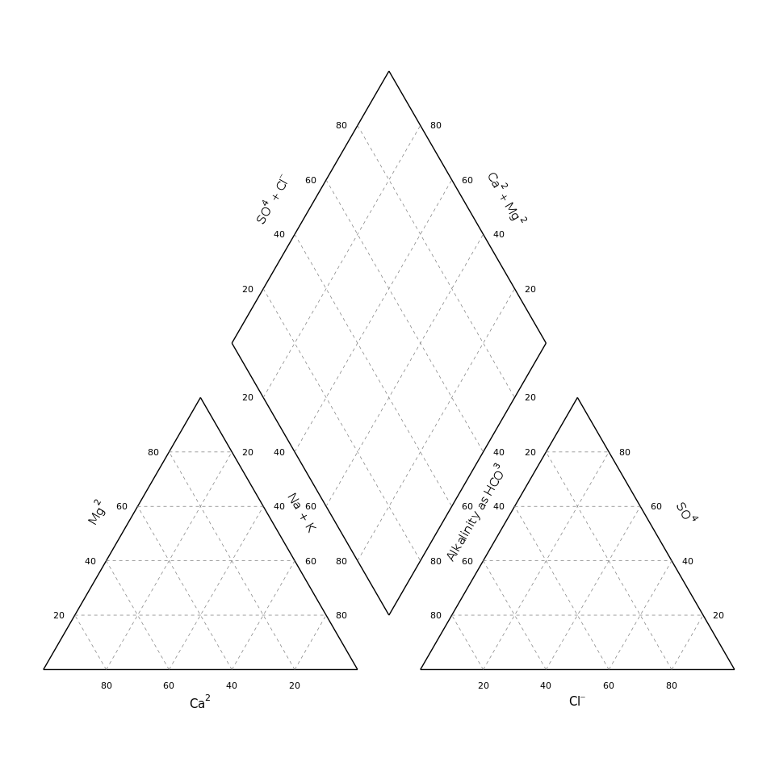
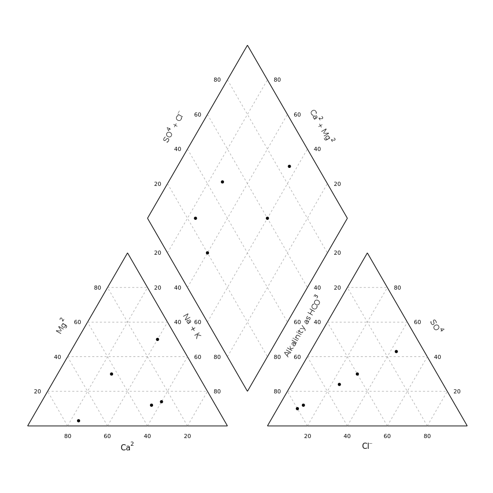
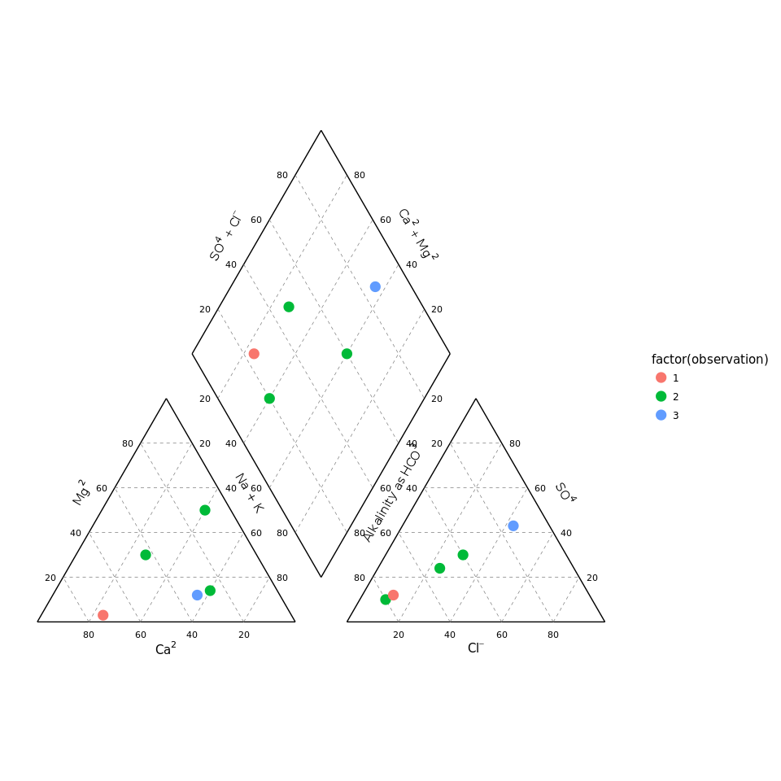

ggplot Piper Diagram
================
Jason Lessels (<jlessels@gmail.com>)
January 24, 2018

A piper diagram based on the ternary plot example here: <http://srmulcahy.github.io/2012/12/04/ternary-plots-r.html>. (Link returns 404, *Note from Marko, Jan 2018*) This was written quickly, and most likely contains bugs - I advise you to check it first.

This now consists of two functions. *transform\_piper\_data()* transforms the data to match the coordinates of the piper diagram. *ggplot\_piper()* does all of the background.

Code
====

``` r
transform_piper_data <- function(Mg, Ca, Cl,SO4, name=NULL){
  if(is.null(name)){
    name = rep(1:length(Mg),3)
  } else {
    name = rep(name,3)
  }
  y1 <- Mg * 0.86603
  x1 <- 100*(1-(Ca/100) - (Mg/200))
  y2 <- SO4 * 0.86603
  x2 <-120+(100*Cl/100 + 0.5 * 100*SO4/100)
  new_point <- function(x1, x2, y1, y2, grad=1.73206){
    b1 <- y1-(grad*x1)
    b2 <- y2-(-grad*x2)
    M <- matrix(c(grad, -grad, -1,-1), ncol=2)
    intercepts <- as.matrix(c(b1,b2))
    t_mat <- -solve(M) %*% intercepts
    data.frame(x=t_mat[1,1], y=t_mat[2,1])
  }
  np_list <- lapply(1:length(x1), function(i) new_point(x1[i], x2[i], y1[i], y2[i]))
  npoints <- do.call("rbind",np_list)
  data.frame(observation=name,x=c(x1, x2, npoints$x), y=c(y=y1, y2, npoints$y))
}


ggplot_piper <- function() {
  library(ggplot2)
  grid1p1 <<- data.frame(x1 = c(20,40,60,80), x2= c(10,20,30,40),y1 = c(0,0,0,0), y2 = c(17.3206,34.6412,51.9618, 69.2824))
  grid1p2 <<- data.frame(x1 = c(20,40,60,80), x2= c(60,70,80,90),y1 = c(0,0,0,0), y2 = c(69.2824, 51.9618,34.6412,17.3206))
  grid1p3 <<- data.frame(x1 = c(10,20,30,40), x2= c(90,80,70,60),y1 = c(17.3206,34.6412,51.9618, 69.2824), y2 = c(17.3206,34.6412,51.9618, 69.2824))
  grid2p1 <<- grid1p1
  grid2p1$x1 <- grid2p1$x1+120
  grid2p1$x2 <- grid2p1$x2+120
  grid2p2 <<- grid1p2
  grid2p2$x1 <- grid2p2$x1+120
  grid2p2$x2 <- grid2p2$x2+120
  grid2p3 <<- grid1p3
  grid2p3$x1 <- grid2p3$x1+120
  grid2p3$x2 <- grid2p3$x2+120
  grid3p1 <<- data.frame(x1=c(100,90, 80, 70),y1=c(34.6412, 51.9618, 69.2824, 86.603), x2=c(150, 140, 130, 120), y2=c(121.2442,138.5648,155.8854,173.2060))
  grid3p2 <<- data.frame(x1=c(70, 80, 90, 100),y1=c(121.2442,138.5648,155.8854,173.2060), x2=c(120, 130, 140, 150), y2=c(34.6412, 51.9618, 69.2824, 86.603))
  
  p <- ggplot() +
    ## left hand ternary plot
    geom_segment(aes(x=0,y=0, xend=100, yend=0)) +
    geom_segment(aes(x=0,y=0, xend=50, yend=86.603)) +
    geom_segment(aes(x=50,y=86.603, xend=100, yend=0)) +
    ## right hand ternary plot
    geom_segment(aes(x=120,y=0, xend=220, yend=0)) +
    geom_segment(aes(x=120,y=0, xend=170, yend=86.603)) +
    geom_segment(aes(x=170,y=86.603, xend=220, yend=0)) +
    ## Upper diamond
    geom_segment(aes(x=110,y=190.5266, xend=60, yend=103.9236)) +
    geom_segment(aes(x=110,y=190.5266, xend=160, yend=103.9236)) +
    geom_segment(aes(x=110,y=17.3206, xend=160, yend=103.9236)) +
    geom_segment(aes(x=110,y=17.3206, xend=60, yend=103.9236)) +
    ## Add grid lines to the plots
    geom_segment(aes(x=x1, y=y1, yend=y2, xend=x2), data=grid1p1, linetype = "dashed", size = 0.25, colour = "grey50") +
    geom_segment(aes(x=x1, y=y1, yend=y2, xend=x2), data=grid1p2, linetype = "dashed", size = 0.25, colour = "grey50") +
    geom_segment(aes(x=x1, y=y1, yend=y2, xend=x2), data=grid1p3, linetype = "dashed", size = 0.25, colour = "grey50") +
    geom_segment(aes(x=x1, y=y1, yend=y2, xend=x2), data=grid2p1, linetype = "dashed", size = 0.25, colour = "grey50") +
    geom_segment(aes(x=x1, y=y1, yend=y2, xend=x2), data=grid2p2, linetype = "dashed", size = 0.25, colour = "grey50") +
    geom_segment(aes(x=x1, y=y1, yend=y2, xend=x2), data=grid2p3, linetype = "dashed", size = 0.25, colour = "grey50") +
    geom_segment(aes(x=x1, y=y1, yend=y2, xend=x2), data=grid3p1, linetype = "dashed", size = 0.25, colour = "grey50") +
    geom_segment(aes(x=x1, y=y1, yend=y2, xend=x2), data=grid3p2, linetype = "dashed", size = 0.25, colour = "grey50") +
    ### Labels and grid values
    #geom_text(aes(50,-10, label="Ca^2"), parse=T, size=4) + # Commented out, as parse=TRUE can cause issues

    geom_text(aes(c(20,40,60,80),c(-5,-5,-5,-5), label=c(80, 60, 40, 20)), size=3) +
    geom_text(aes(c(35,25,15,5),grid1p2$y2, label=c(80, 60, 40, 20)), size=3) +
    geom_text(aes(c(95,85,75,65),grid1p3$y2, label=c(80, 60, 40, 20)), size=3) +
    # geom_text(aes(17,50, label="Mg^2"), parse=T, angle=60, size=4) +
    coord_equal(ratio=1)+  
    geom_text(aes(17,50, label="Mg^2"), angle=60, size=4, parse=TRUE) +  
    geom_text(aes(82.5,50, label="Na + K"), angle=-60, size=4) +
   geom_text(aes(50,-10, label="Ca^2"), size=4, parse=TRUE) +
    
    
    geom_text(aes(170,-10, label="Cl^-phantom()"), size=4, parse=TRUE) +
    geom_text(aes(205,50, label="SO^4"), angle=-60, size=4, parse=TRUE) +
    geom_text(aes(137.5,50, label="Alkalinity~as~HCO^3"), angle=60, size=4, parse=TRUE) +
    geom_text(aes(72.5,150, label="SO^4~+~Cl^-phantom()"), angle=60, size=4, parse=TRUE) +
    geom_text(aes(147.5,150, label="Ca^2~+~Mg^2"), angle=-60, size=4, parse=TRUE) + 

    geom_text(aes(c(155,145,135,125),grid2p2$y2, label=c(20, 40, 60, 80)), size=3) +
    geom_text(aes(c(215,205,195,185),grid2p3$y2, label=c(20, 40, 60, 80)), size=3) +
    geom_text(aes(c(140,160,180,200),c(-5,-5,-5,-5), label=c(20, 40, 60, 80)), size=3) +
    geom_text(aes(grid3p1$x1-5,grid3p1$y1, label=c(80, 60, 40, 20)), size=3) +
    geom_text(aes(grid3p1$x2+5,grid3p1$y2, label=c(20, 40, 60, 80)), size=3) +
    geom_text(aes(grid3p2$x1-5,grid3p2$y1, label=c(20, 40, 60, 80)), size=3) +
    geom_text(aes(grid3p2$x2+5,grid3p2$y2, label=c(80, 60, 40, 20)), size=3) +
    theme_bw() +
    theme(panel.grid.major = element_blank(), panel.grid.minor = element_blank(),
          panel.border = element_blank(), axis.ticks = element_blank(),
          axis.text.x = element_blank(), axis.text.y = element_blank(),
          axis.title.x = element_blank(), axis.title.y = element_blank())
  return(p)
}
```

Example
=======

Data input
----------

``` r
data <- as.data.frame(list("Ca"  = c(43, 10, 73, 26, 32),
                        "Mg"  = c(30, 50, 3, 14, 12),
                        "Cl"  = c(24, 10, 12, 30, 43),
                        "SO4" = c(24, 10, 12, 30, 43),
                        "WaterType" = c(2, 2, 1, 2, 3)),
                   row.names = c("A", "B", "C", "D", "E"))
data
```

    ##   Ca Mg Cl SO4 WaterType
    ## A 43 30 24  24         2
    ## B 10 50 10  10         2
    ## C 73  3 12  12         1
    ## D 26 14 30  30         2
    ## E 32 12 43  43         3

Transformation
--------------

``` r
piper_data <- transform_piper_data(Ca = data$Ca,
                                   Mg = data$Mg,
                                   Cl = data$Cl,
                                   SO4 = data$SO4,
                                   name = data$WaterType)

piper_data
```

    ##    observation     x         y
    ## 1            2  42.0  25.98090
    ## 2            2  65.0  43.30150
    ## 3            1  25.5   2.59809
    ## 4            2  67.0  12.12442
    ## 5            3  62.0  10.39236
    ## 6            2 156.0  20.78472
    ## 7            2 135.0   8.66030
    ## 8            1 138.0  10.39236
    ## 9            2 165.0  25.98090
    ## 10           3 184.5  37.23929
    ## 11           2  97.5 122.11023
    ## 12           2  90.0  86.60300
    ## 13           1  84.0 103.92360
    ## 14           2 120.0 103.92360
    ## 15           3 131.0 129.90450

Plot
----

The piper function now just plots the background

``` r
ggplot_piper()
```



Now points can be added like...

``` r
ggplot_piper() + geom_point(aes(x,y), data=piper_data)
```



... colouring the points can be done using the observation value

``` r
ggplot_piper() + geom_point(aes(x,y, colour=factor(observation)), data=piper_data)
```


The size can be changed like..

``` r
ggplot_piper() + geom_point(aes(x,y, colour=factor(observation)), size=4, data=piper_data)
```



Advanced example:

``` r
ggplot_piper() + 
  geom_point(aes(x, y,
                 colour = factor(observation),
                 shape  = factor(observation)), 
             size=4, data = piper_data) + 
  scale_colour_manual(name="legend name must be the same", values=c("#999999", "#E69F00", "#56B4E9"), labels=c("Control", "Treatment 1", "Treatment 2")) +
  scale_shape_manual(name="legend name must be the same", values=c(1,2,3), labels=c("Control", "Treatment 1", "Treatment 2")) +
  theme(legend.position = c(.8, .9))
```


